# Compte-rendu TP2 - Partie II

*Configuration : 1 PC Windows et 1 Mac* (Fait seul avec 2 pc à la maison)

---

## II. Exploration locale en duo (Adapté en solo)

### 1 & 2. Prérequis et Câblage
* **Matériel utilisé :** Un PC Windows et un Mac reliés directement par un câble RJ45.
* **Pare-feu :** Les pare-feux (Windows Defender et Coupe-feu macOS) ont été désactivés sur les deux machines pour ne pas bloquer le trafic local.

### 3. Création du réseau et modification d'adresses IP

Pour créer notre "réseau", nous avons défini manuellement des adresses IP statiques sur nos cartes Ethernet. Nous avons choisi d'inventer le réseau `172.16.18.0/24`.

* **Configuration sur le PC Windows :**
  * Modification via les paramètres de carte réseau (ncpa.cpl) > IPv4.
  * Adresse IP : `172.16.18.1`
  * Masque de sous-réseau : `255.255.255.0`

* **Configuration sur le Mac :**
  * Modification via Réglages Système > Réseau > Ethernet > TCP/IP (Configuration manuelle).
  * Adresse IP : `172.16.18.2`
  * Masque de sous-réseau : `255.255.255.0`

### **Validation de la connectivité avec un réseau /24 :**

Pour vérifier que les deux machines communiquent, nous avons utilisé l'outil de diagnostic `ping`.

*Depuis le terminal du Mac vers le PC Windows :*
`ping 172.16.18.1`

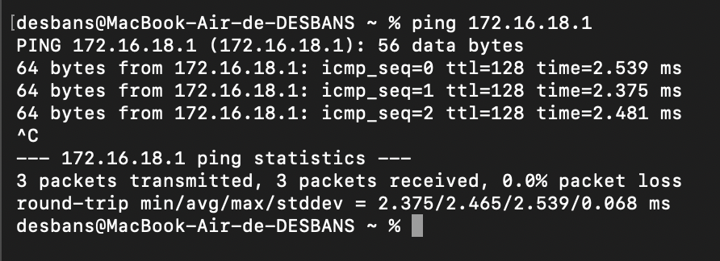

*Depuis l'invite de commande Windows vers le Mac :*

`ping 172.16.18.2`

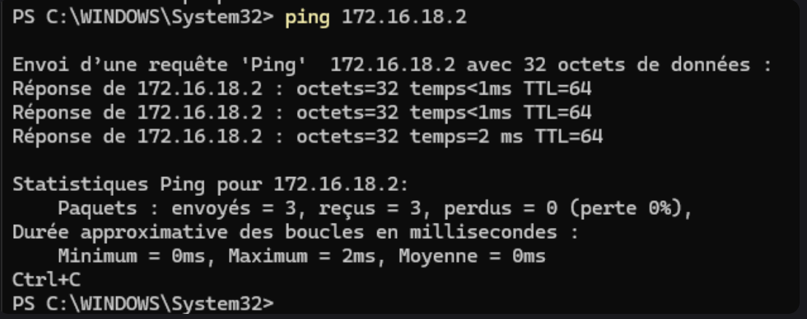

### **Test avec un masque /20 :**

Conformément aux consignes, nous avons modifié le masque de sous-réseau pour un `/20`. En notation décimale, cela correspond à `255.255.240.0`.

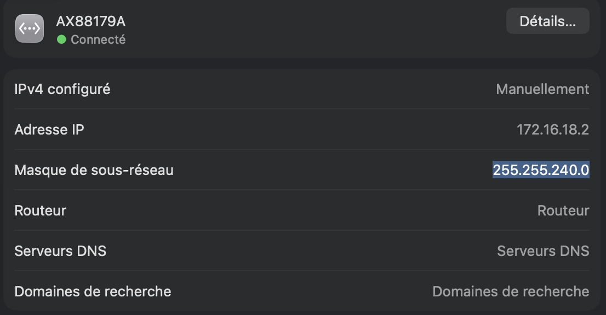

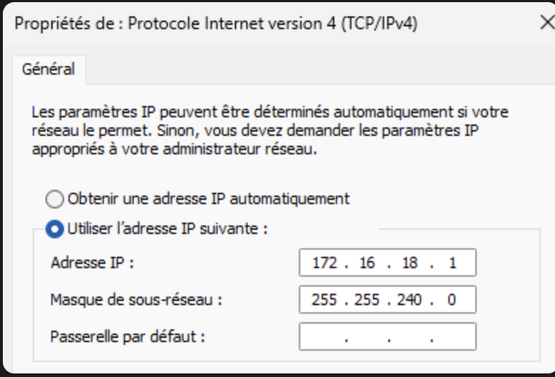

### *Depuis le terminal, le ping fonctionne toujours correctement :*

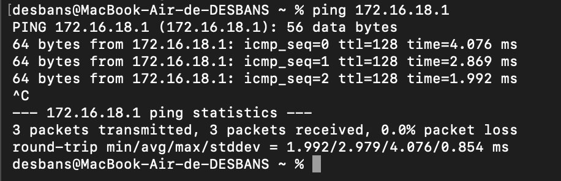

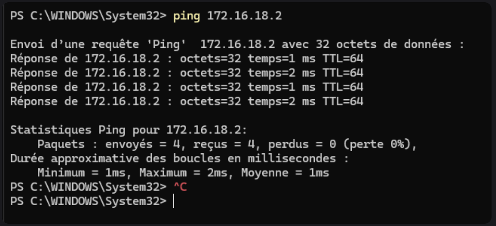

## **Test avec le plus petit réseau possible (/30) :**

Le plus petit réseau permettant de connecter exactement 2 hôtes est un réseau avec un masque `/30`. Il fournit 4 adresses au total (1 réseau, 1 broadcast, et 2 IP utilisables). Le masque décimal est `255.255.255.252`. 
Nos adresses `172.16.18.1` et `172.16.18.2` rentrent parfaitement dans ce sous-réseau, qui va de `.0` (réseau) à `.3` (broadcast).

*Test de connectivité :*

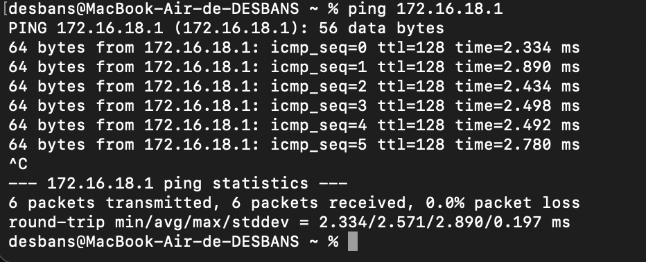

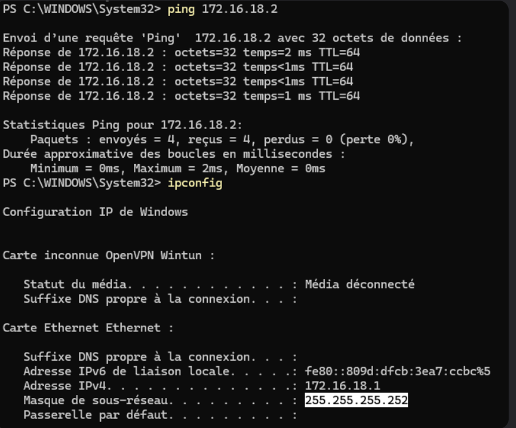

### 4. Utilisation d'un des deux comme gateway

L'objectif de cette étape était de simuler un routeur en partageant la connexion Internet d'une machine vers l'autre, via le câble Ethernet.

* Le **PC Windows** a été désigné comme passerelle (gateway).
* Le **Mac** a été désigné comme client déconnecté du réseau WiFi.

**Configuration effectuée :**

1. Sur Windows, le partage de connexion Internet (ICS) a été activé sur la carte WiFi au profit de la carte Ethernet. Windows a automatiquement redéfini l'IP de la carte Ethernet sur `192.168.137.1`.

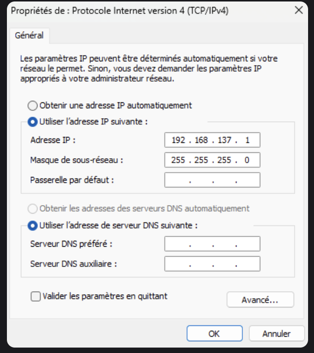

2. Le WiFi a été désactivé sur le Mac.

3. L'interface Ethernet du Mac a été reconfigurée dans ce nouveau sous-réseau :

   * IP : `192.168.137.2`
   * Masque : `255.255.255.0`
   * Passerelle (Gateway) : `192.168.137.1` (IP du PC Windows)

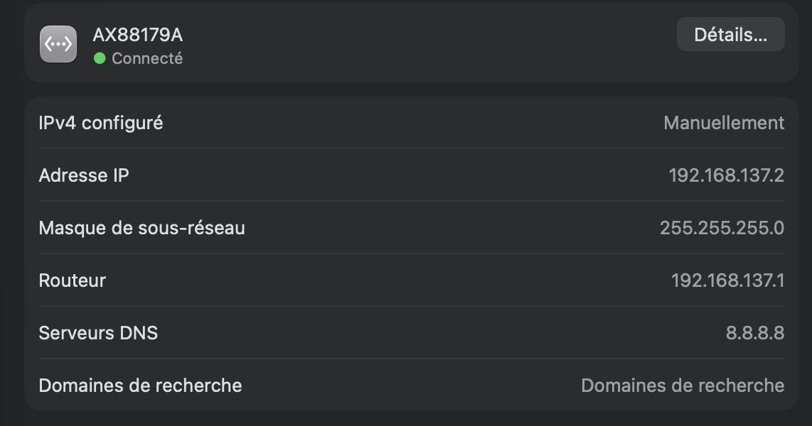

**Test de connectivité :**

Pour vérifier que le Mac accède bien à Internet via le PC Windows, nous avons effectué un ping vers le serveur DNS de Google depuis le terminal du Mac :

`ping 8.8.8.8`

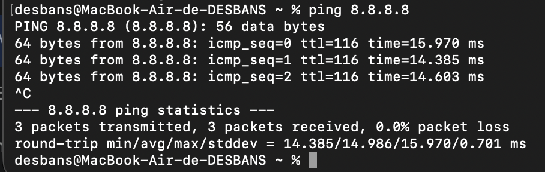

### 5. Petit chat privé avec `nc` (Netcat)

L'objectif de cette étape est d'établir une connexion TCP simple entre les deux machines pour créer une messagerie textuelle basique.
* **Le Mac** a joué le rôle de **Serveur**, en utilisant l'outil `nc` installé nativement.
* **Le PC Windows** a joué le rôle de **Client**. Suite à des blocages de l'antivirus Windows Defender sur le binaire `nc.exe` classique, j'ai utilisé `ncat`, l'équivalent moderne fourni avec la suite logicielle `nmap`.

**Commandes exécutées :**
1. Sur le Mac (Serveur, IP: `192.168.137.2`), nous avons mis netcat en écoute sur le port 8888 :
   `nc -l 8888`

2. Sur le PC Windows (Client, IP: `192.168.137.1`), nous nous sommes connectés à l'IP du Mac sur le port défini avec ncat :
   `ncat 192.168.137.2 8888`

**Résultat :**
Une fois la connexion établie, les messages saisis dans le terminal d'une machine s'affichent instantanément sur l'autre.

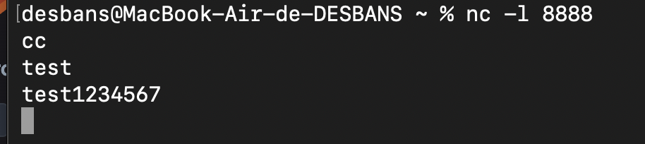

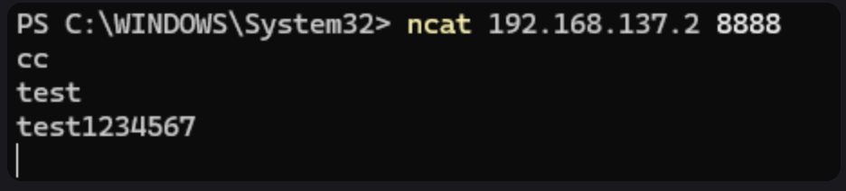

### 6. Analyse du réseau avec Wireshark

Pour cette étape, nous avons utilisé le logiciel Wireshark pour capturer et analyser les trames circulant sur notre interface Ethernet lors de différentes manipulations réseau.

**A. Observation d'un `ping` local :**

En appliquant le filtre `icmp`, nous avons observé le trafic généré par un ping entre nos deux machines.
On distingue clairement les paquets **Echo Request** (type 8, envoyés par la source) et les paquets **Echo Reply** (type 0, renvoyés par la destination).

**B. Observation de la communication `netcat` :**

En appliquant le filtre `tcp.port == 8888`, nous avons isolé le trafic de notre messagerie instantanée. 
En suivant le flux TCP (Follow TCP Stream), nous pouvons constater que le texte échangé entre le client et le serveur circule "en clair" (non chiffré) sur le réseau.

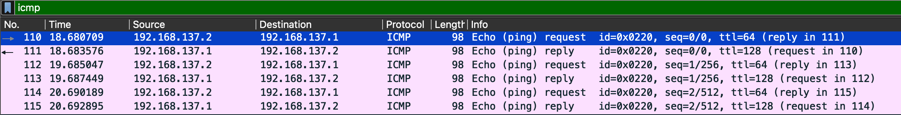

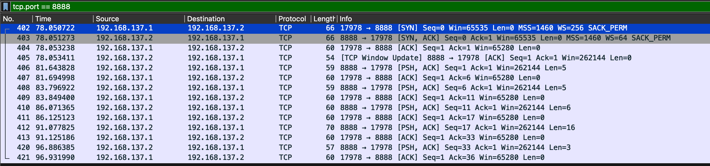

Lors du ping vers `8.8.8.8` depuis le Mac (client sans WiFi), la capture Wireshark sur l'interface Ethernet montre bien des paquets ICMP ayant pour source l'IP locale du Mac (`192.168.137.2`) et pour destination l'IP publique de Google (`8.8.8.8`). Cela confirme que le trafic transite physiquement par le câble vers la passerelle Windows.

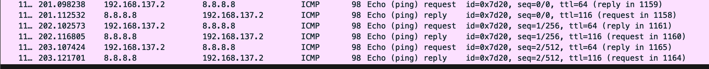

### 7. Manipulation basique de pare-feu

L'objectif final de cette exploration locale était de réactiver nos pare-feux respectifs (Windows Defender Firewall et macOS Coupe-feu) et de créer des règles d'exception strictes pour autoriser nos flux de tests.

**A. Autorisation du `ping` (ICMP) :**

Le pare-feu Windows bloquant le ping par défaut, une règle de trafic entrant a été configurée dans les paramètres de sécurité avancés (wf.msc).

* **Protocole autorisé :** ICMPv4
* **Type spécifique :** Type 8 (Demande d'écho / Echo Request)
Suite à l'application de cette règle, le Mac a de nouveau pu "pinger" le PC Windows avec succès malgré l'activation du pare-feu.

**B. Autorisation de `nc` sur un port spécifique :**

Nous avons défini le **PC Windows comme Serveur** et choisi arbitrairement le **port 15000** (compris entre 1024 et 20000).
Une seconde règle de trafic entrant a été ajoutée sur le pare-feu Windows :
* **Type :** Port
* **Protocole :** TCP
* **Port local spécifique :** 15000
* **Action :** Autoriser la connexion

**Test de validation :**
1. Mise en écoute du serveur sur Windows : `ncat -l -p 15000`
2. Connexion du client depuis le Mac : `nc 192.168.137.1 15000`
La messagerie a fonctionné parfaitement, prouvant que notre règle d'ouverture de port TCP a été correctement appliquée.

