# TP 2 - LINUX B1

## I. Exploration locale en solo

### 1. Affichage d'informations sur la pile TCP/IP locale

### En ligne de commande : 

#### **Interface WIFI** :

commande = `ifconfig en0`

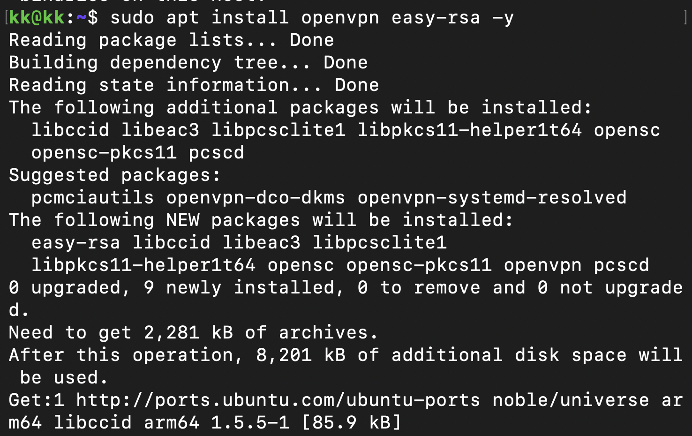

- Nom de l'interface : `en0`

- Adresse MAC (ether) : `56:97:6d:0b:27:44`

- Adresse IP (inet) : `10.33.68.116`

- Adresse de Broadcast : `10.33.79.255`

- Adresse de Réseau : `10.33.64.0`

#### **Interface ETHERNET** (Non applicable MacBook Air sans port Ethernet ni adaptateur branché) : 

#### **AFFICHER GATEWAY**

Commande = `route get default | grep gateway`

- gateway = `10.33.79.254`

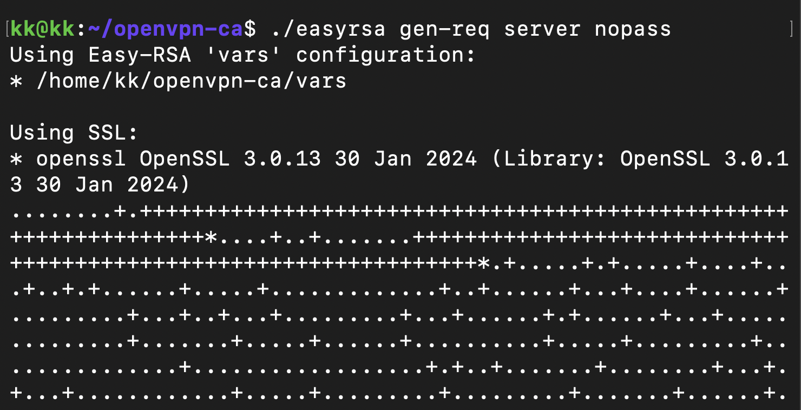

### En graphique (GUI : Graphical User Interface)

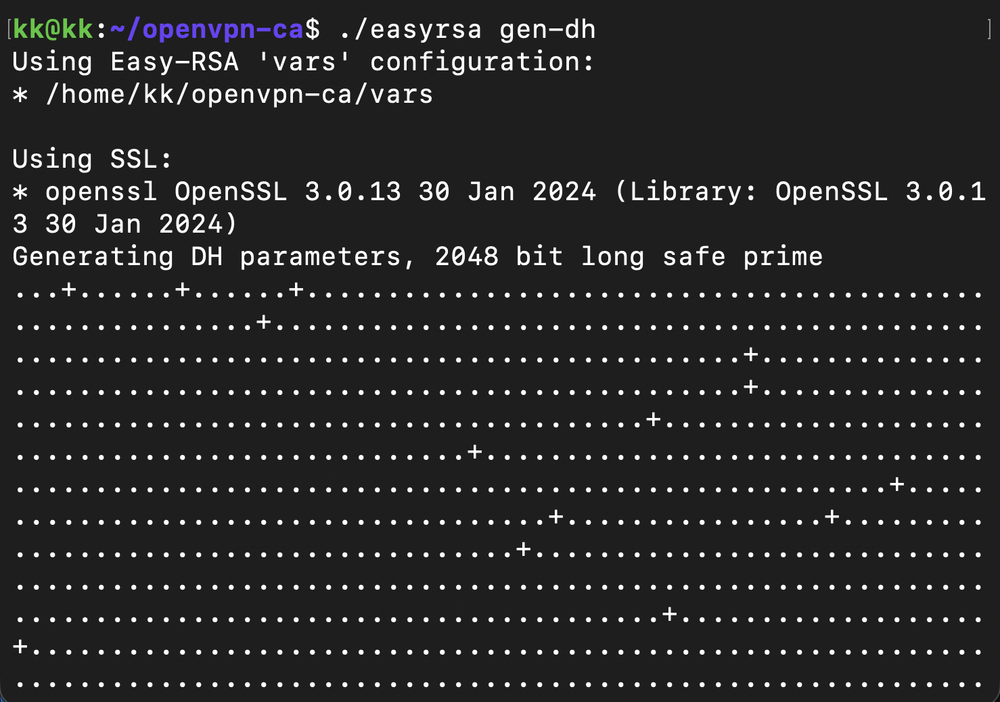

### **Questions** : à quoi sert la gateway dans le réseau d'Ingésup ?

- Dans le réseau d'Ingésup, la gateway sert à sortir du réseau local pour accéder à d'autres réseaux, et principalement à Internet.

### 2. Modifications des informations

Adresse IP actuel : `10.33.68.116`

Première IP disponible : `10.33.64.1`

Dernière IP disponible : `10.33.79.254`

#### **A. Modification d'adresse IP - pt. 1** : 

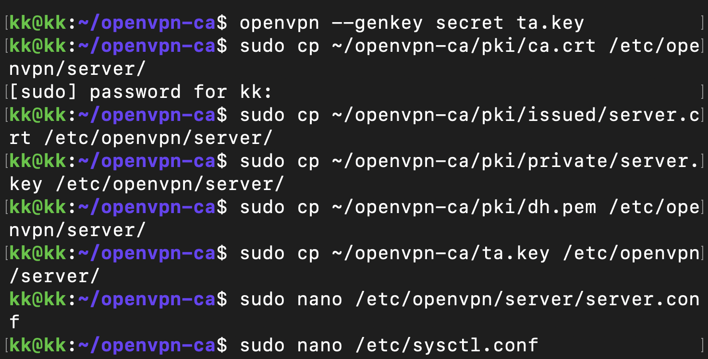

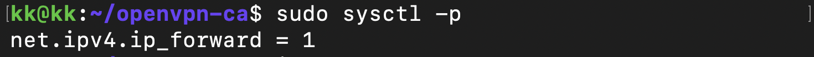

#### **B. nmap**

Commande = `nmap -sP 192.168.1.0/24`

#### **C. Modification d'adresse IP - pt. 2**

Adresse libre + modification gateway :

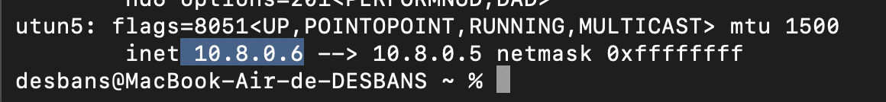

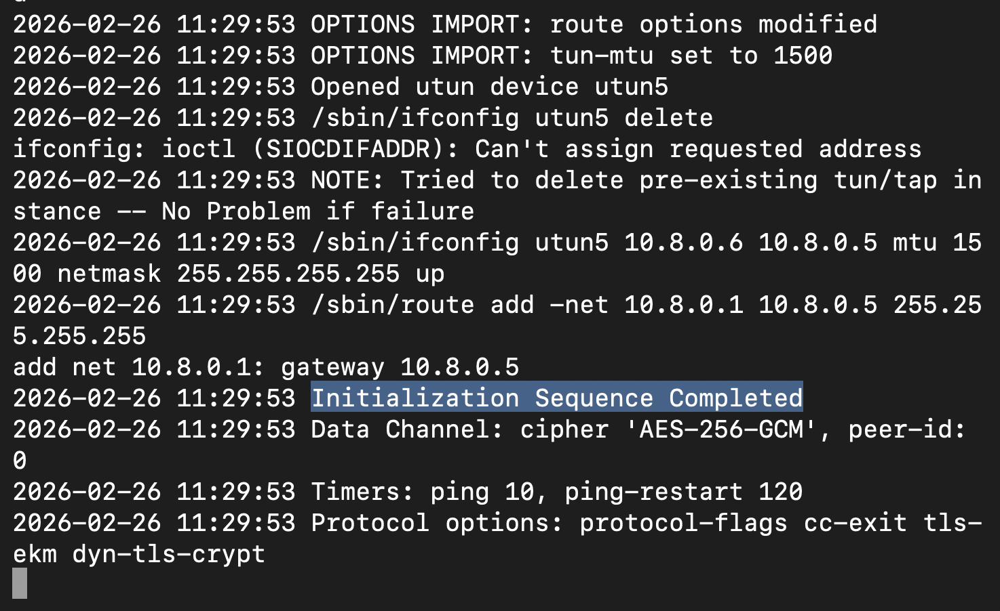

## **III. Manipulations d'autres outils/protocoles côté client**

#### **1. DHCP**

Commande pour voir les détails cachés du DHCP : `ipconfig getpacket en0` 

Adresse IP du serveur DHCP : `10.33.79.254``

Durée du bail (DHCP Lease) : `0x866c`

Conversion : 0x866c en décimal = `34 412 secondes`

En heures : 34412 / 3600 ≈ 9,5 heures (environ 9h30). Le bail dure environ 9h30. L'expiration sera donc `(heure actuelle) + 9h30.

Renouvellement de l'IP : `sudo ipconfig set en0 DHCP`

#### **2. DNS**

- Trouver l'adresse IP du serveur DNS : `scutil --dns | grep nameserver` 

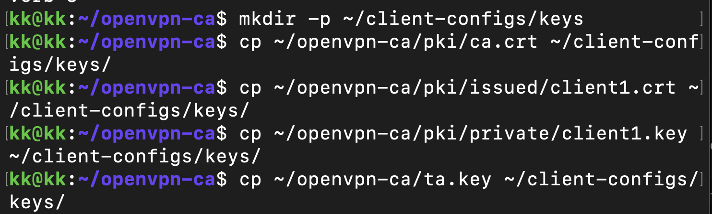

- dig : 

Pour google : `dig google.com`

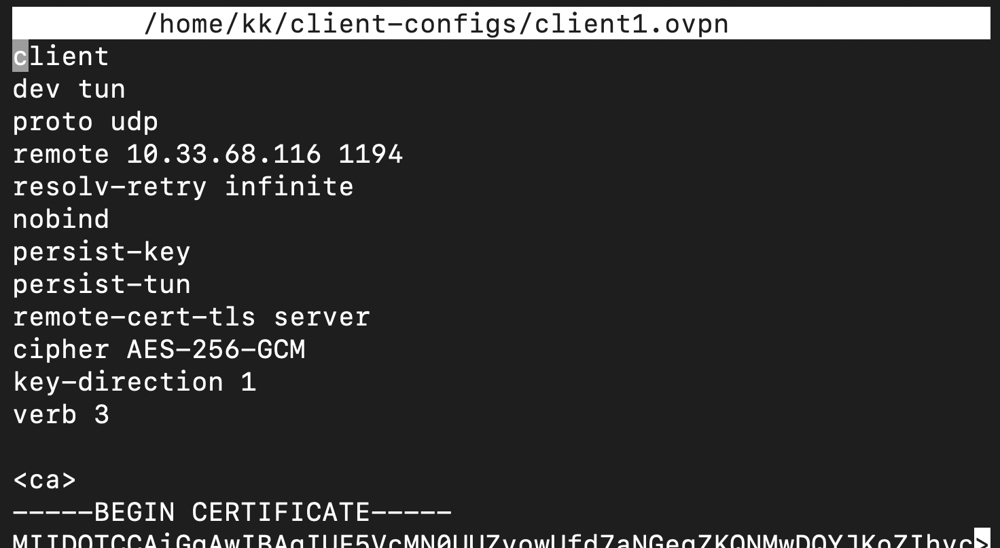

J'ai demandé à mon serveur DNS quelle est l'adresse IP associée au nom google.com. Dans la partie ANSWER SECTION, le serveur m'a répondu que le site se trouve à l'adresse IP : 216.58.213.78. C'est l'adresse d'un des serveurs de Google.

Pour Ynov : `dig ynov.com`

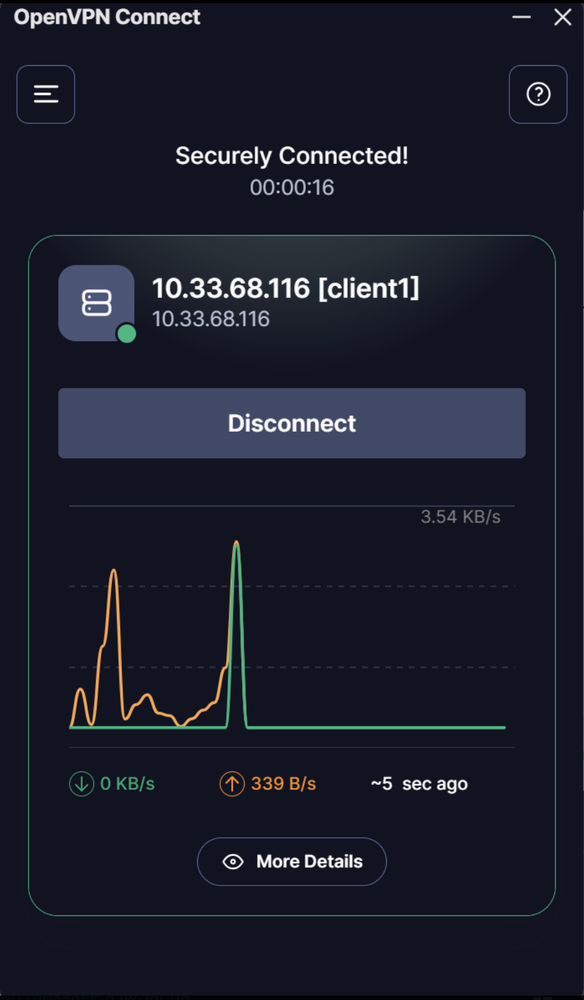

J'ai demandé l'adresse IP pour ynov.com. Dans la ANSWER SECTION, le serveur m'a renvoyé 3 adresses IP différentes (104.26.11.233, 172.67.74.226, etc.). Cela signifie que le site d'Ynov est hébergé sur plusieurs serveurs en même temps.

Commande = `dig -x 78.78.21.21`

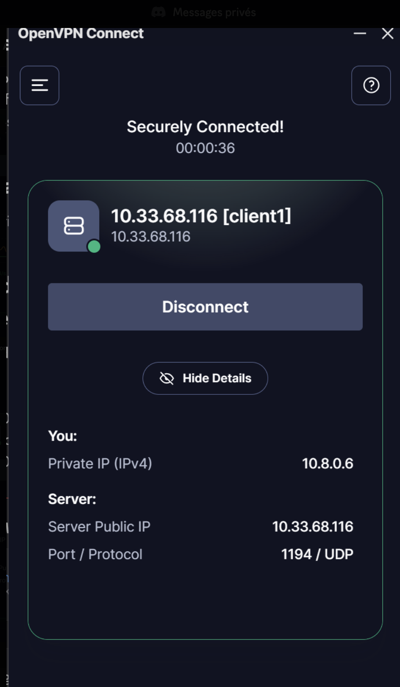

J'ai demandé à l'annuaire inverse quel nom de domaine correspond à l'IP 78.78.21.21. Dans la ANSWER SECTION, le serveur a trouvé un enregistrement PTR (Pointeur) : host-78-78-21-21.mobileonline.telia.com. Cela signifie que cette IP appartient à l'opérateur Telia

Commande = `dig -x 92.16.54.88`

J'ai fait la même demande pour l'IP 92.16.54.88. Le serveur a également trouvé un nom : host-92-16-54-88.as13285.net. Cette adresse IP possède donc elle aussi une configuration inverse valide (Reverse DNS).

