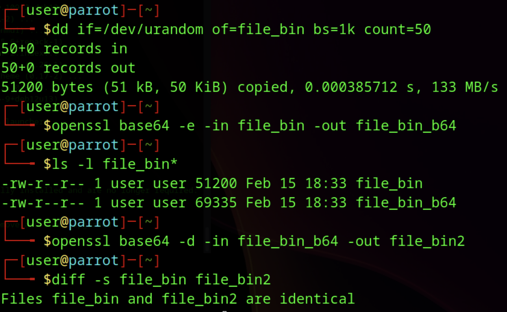
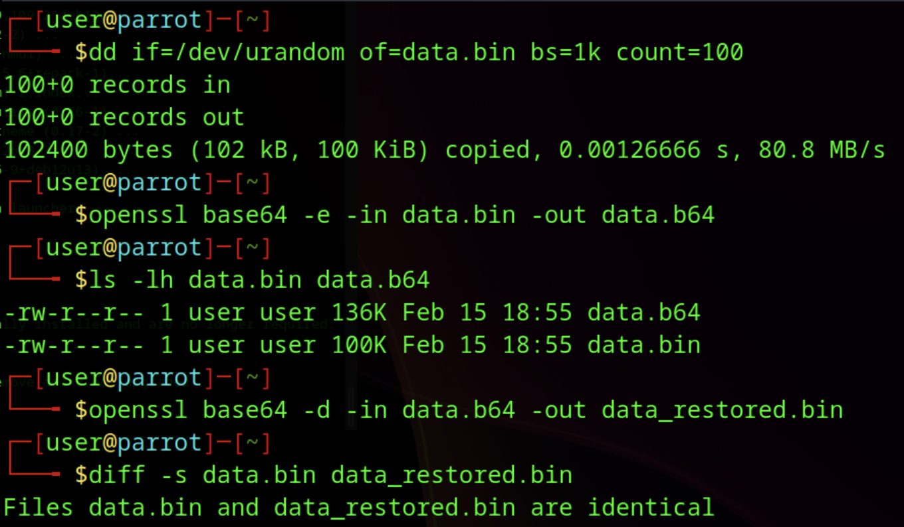
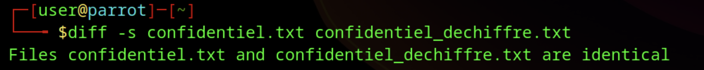
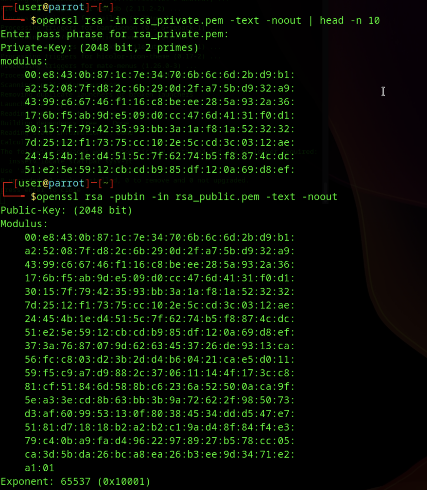
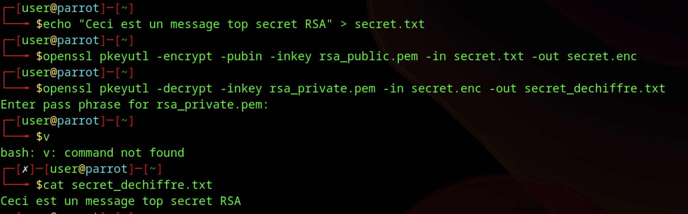
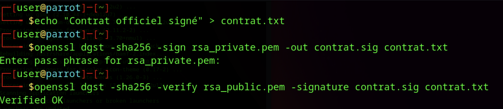
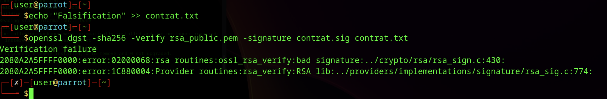

# B1 Linux - TP3

## I. Exploration en solo

### 1. Base64

* **Observation sur la taille :** J'ai remarqué que le fichier encodé en base64 est plus lourd que le fichier binaire original.

* **Vérification :** La commande `diff -s` a confirmé que le fichier décodé est identique à l'original.

### 2. AES (Symétrique)

* **Rôle du sel (Salt) :** Comme expliqué dans le TP, le sel permet de générer des fichiers chiffrés différents même si le mot de passe et le fichier original sont identiques, protégeant contre les attaques par dictionnaire (Rainbow Tables).

* **Différence binaire vs Base64 :** Le premier fichier chiffré (`message_c`) est illisible (binaire), alors que `message_c2` (avec l'option `-a`) est en caractères imprimables.

### 3. RSA (Asymétrique)

* **Test de chiffrement :** J'ai chiffré un fichier avec la clé publique et je n'ai pu le déchiffrer qu'avec la clé privée correspondante.

## II - Approfondissement

## A. Base64

* **Preuve d'intégrité :** Les fichiers `data.bin` et `data_restored.bin` sont identiques (voir screenshot).

**Réponses aux questions :**

1. **Base64 est-il un chiffrement ?** Non, c'est un encodage. Il n'utilise pas de clé secrète et n'importe qui peut le décoder. Son but est le transport de données, pas la confidentialité.

2. **Pourquoi la taille change ?** Base64 utilise 4 caractères ASCII (4 octets) pour représenter 3 octets de données binaires. Cela crée une augmentation mécanique de la taille.

3. **Pourcentage d'augmentation :** Environ 33% (4/3 = 1.33).

4. **Méthode de vérification rigoureuse :** On utilise la commande `diff` (comparaison bit à bit) ou on compare les empreintes numériques (hash) avec `md5sum` ou `sha256sum`.

## B. Chiffrement symétrique – AES
* **Algorithme utilisé :** AES-256-CBC avec Salt et PBKDF2 (SHA256).

**Analyse du sel (Salt) :**
J'ai chiffré deux fois le même fichier avec le même mot de passe. Les fichiers de sortie sont binaires différents.

**Réponses aux questions :**

1. **Pourquoi les fichiers chiffrés sont différents ?** Grâce au "sel" (salt). C'est une donnée aléatoire générée à chaque chiffrement et ajoutée au mot de passe pour créer la clé de chiffrement finale.

2. **Rôle du sel :** Il empêche les attaques par dictionnaire (Rainbow Tables) et fait en sorte que deux messages identiques produisent des textes chiffrés différents.

3. **Si une option change au déchiffrement :** Le déchiffrement échoue (bad decrypt) ou produit des données corrompues, car la clé dérivée ne sera pas la bonne.

4. **Pourquoi PBKDF2 ?** C'est une fonction de dérivation de clé qui ralentit le processus (par itérations) pour rendre les attaques par force brute beaucoup plus difficiles.

5. **Différence Encodage vs Chiffrement :** L'encodage (ex: Base64) change le format pour la compatibilité (public). Le chiffrement (ex: AES) rend les données illisibles sans une clé secrète (privé).

## C. Cryptographie asymétrique – RSA

* **Clés :** Paire de clés 2048 bits générée.

* **Protection :** Clé privée chiffrée en AES-256.

**Réponses aux questions :**

1. **Pourquoi ne pas partager la clé privée ?** Car elle permet de déchiffrer tout ce qui est envoyé et de signer des documents en votre nom (usurpation 
d'identité).

2. **Pourquoi RSA n'est pas adapté aux gros fichiers ?** C'est un algorithme lent et gourmand en ressources mathématiques. De plus, on ne peut pas chiffrer plus de données que la taille de la clé (minus le padding).

3. **Différences paramètres Public/Privé :** La clé publique ne contient que le Modulo et l'Exposant public. La clé privée contient tout cela PLUS l'exposant privé et les nombres premiers qui ont servi à la création (les secrets mathématiques).

4. **Rôle du modulo :** C'est le produit des deux grands nombres premiers. Il sert de base commune pour les opérations de chiffrement et déchiffrement.

5. **Pourquoi chiffrer une clé AES avec RSA ?** C'est le principe du chiffrement hybride. On utilise AES (rapide) pour chiffrer le gros fichier, et RSA (sécurisé pour l'échange) juste pour envoyer la clé AES au destinataire.

## D. Signature numérique

J'ai utilisé la commande `openssl dgst` pour signer l'empreinte du fichier.

**Réponses aux questions :**

1. **Que se passe-t-il après modification ?** La vérification échoue ("Verification Failure").

2. **Pourquoi ?** Car le hash du fichier modifié ne correspond plus au hash qui a été signé (chiffré) dans le fichier `.sig`.

3. **Rôle du hachage dans la signature :** On ne signe pas tout le fichier (trop lent), on signe uniquement son empreinte (hash). Cela garantit l'intégrité.

4. **Différence Signature vs Chiffrement :** 

* **Chiffrement :** Clé Publique pour chiffrer (Confidentialité).

* **Signature :** Clé Privée pour signer (Authentification et Intégrité).

## Annexe : Toutes les commandes utilisées (Partie II)

**A. BASE64**
* `dd if=/dev/urandom of=data.bin bs=1k count=100`
* `openssl base64 -e -in data.bin -out data.b64`
* `ls -lh data.bin data.b64`
* `openssl base64 -d -in data.b64 -out data_restored.bin`
* `diff -s data.bin data_restored.bin`

**B. AES**
* `echo -e "Nom: Moi\nDate: Auj\n..." > confidentiel.txt`
* `openssl enc -e -aes-256-cbc -salt -pbkdf2 -md sha256 -in confidentiel.txt -out confidentiel.enc`
* `openssl enc -d -aes-256-cbc -salt -pbkdf2 -md sha256 -in confidentiel.enc -out confidentiel_dechiffre.txt`
* `openssl enc -e -aes-256-cbc -salt -pbkdf2 -md sha256 -in confidentiel.txt -out confidentiel_bis.enc`
* `diff confidentiel.enc confidentiel_bis.enc`

**C. RSA**
* `openssl genrsa -aes256 -out rsa_private.pem 2048`
* `openssl rsa -in rsa_private.pem -pubout -out rsa_public.pem`
* `openssl rsa -in rsa_private.pem -text -noout`
* `openssl rsa -pubin -in rsa_public.pem -text -noout`
* `echo "Secret RSA" > secret.txt`
* `openssl pkeyutl -encrypt -pubin -inkey rsa_public.pem -in secret.txt -out secret.enc`
* `openssl pkeyutl -decrypt -inkey rsa_private.pem -in secret.enc -out secret_dechiffre.txt`

**D. SIGNATURE**
* `echo "Contrat" > contrat.txt`
* `openssl dgst -sha256 -sign rsa_private.pem -out contrat.sig contrat.txt`
* `openssl dgst -sha256 -verify rsa_public.pem -signature contrat.sig contrat.txt`
* `echo "Hack" >> contrat.txt`
* `openssl dgst -sha256 -verify rsa_public.pem -signature contrat.sig contrat.txt`