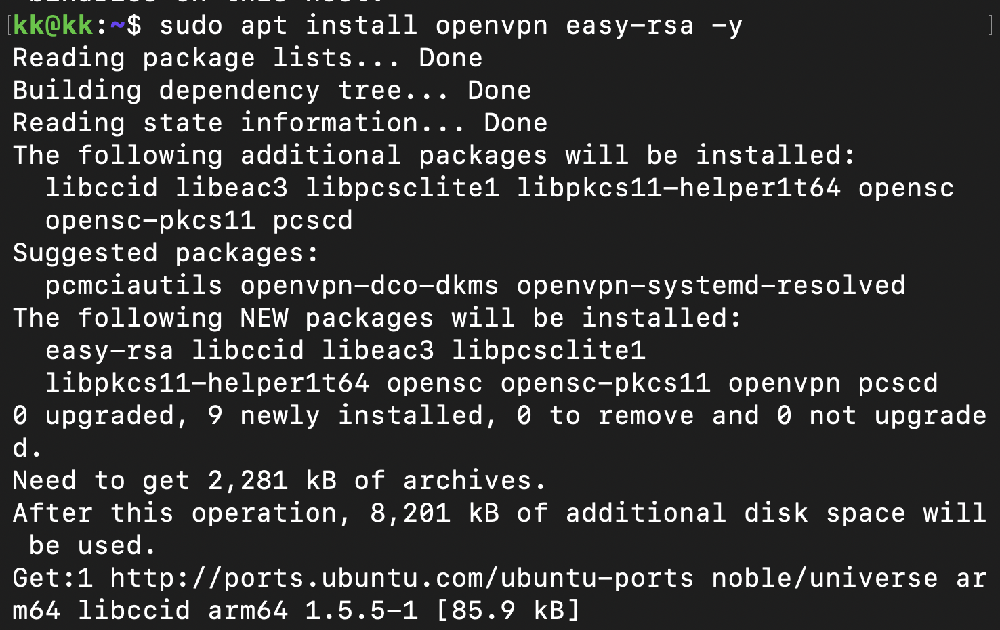
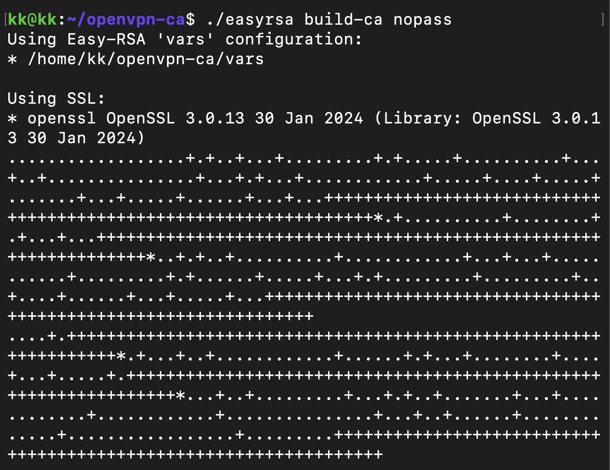
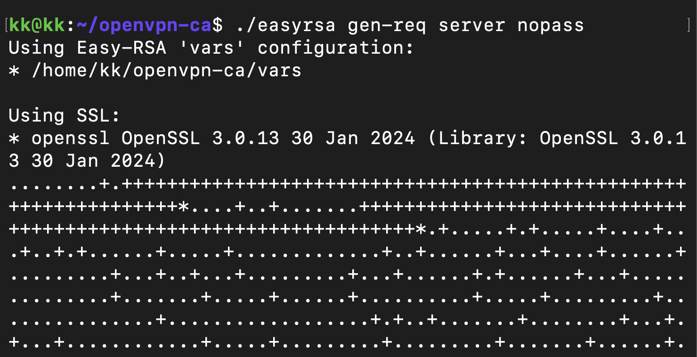
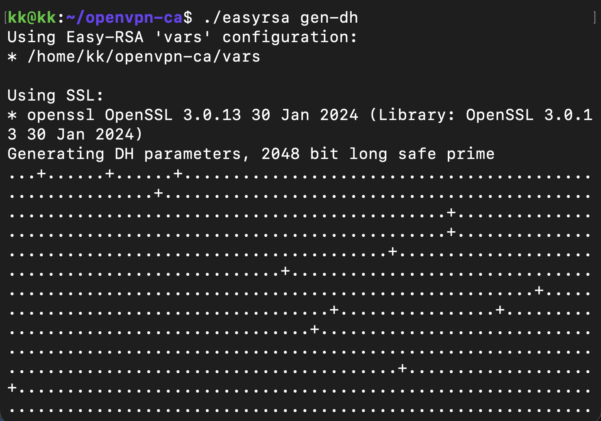
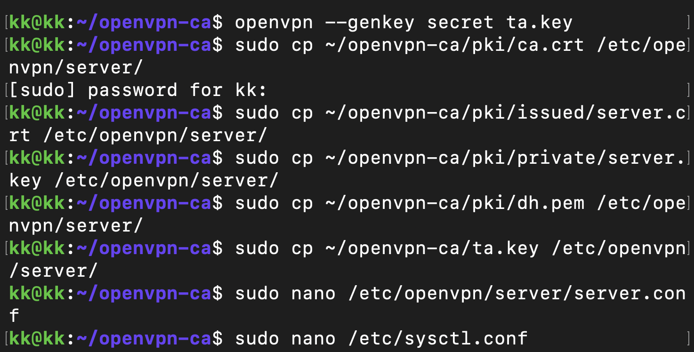
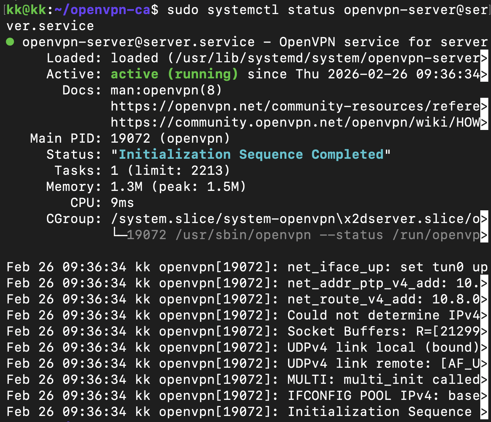
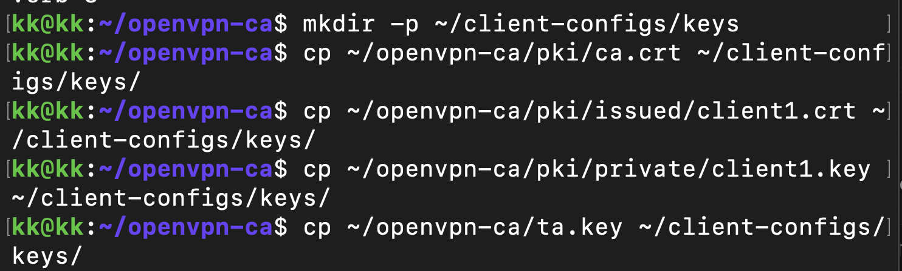
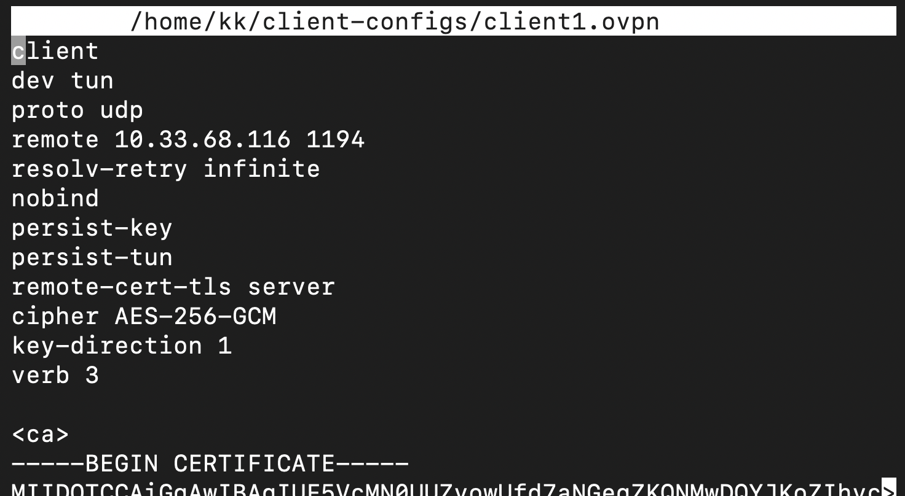
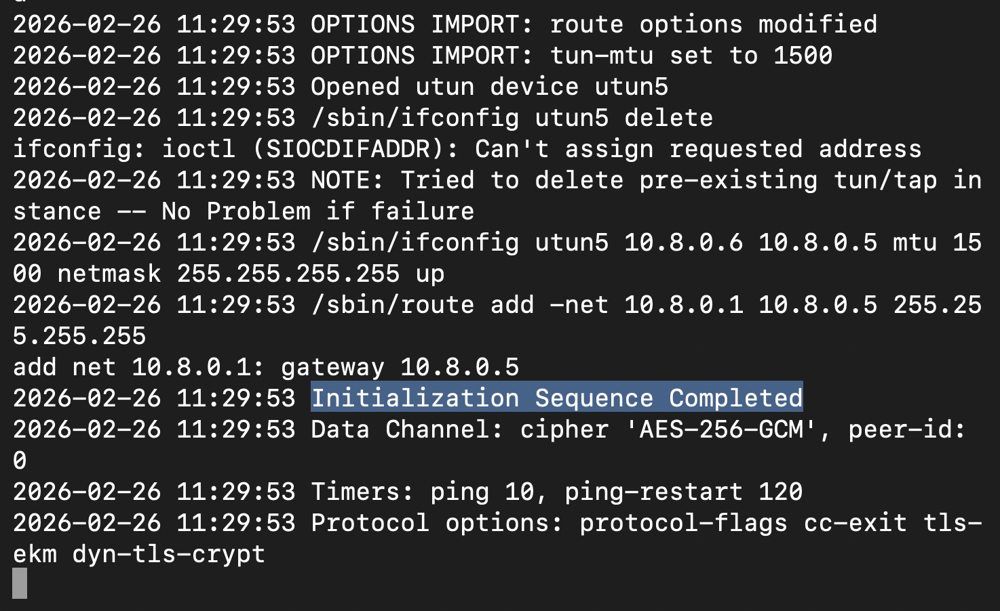

# TP-6 | Mise en place d'un serveur OpenVPN sur Ubuntu Server

## Préparation du système
*Mise à jour du système et installation des paquets `openvpn` et `easy-rsa` via SSH.*



---

## Partie 1 : Comprendre la PKI

### 1. À quoi sert une autorité de certification (CA) ?

L'Autorité de Certification (CA) agit comme un **tiers de confiance**. C'est l'entité maîtresse qui signe les certificats des clients et du serveur.

* **Rôle principal :** Elle garantit l'identité des participants. Si une machine (client ou serveur) présente un certificat signé par la CA, alors on lui fait confiance.

* **Analogie :** C'est comme la Préfecture qui délivre les cartes d'identité. Si la carte est valide (signée par l'État), on fait confiance à l'identité de la personne.

### 2. Quelle différence entre clé privée et certificat ?

* **Clé privée (`.key`) :** C'est le **secret**. Elle permet de déchiffrer les données reçues et de signer numériquement les données envoyées. Elle ne doit **jamais** être partagée ni quitter la machine qui l'a créée.

* **Certificat (`.crt`) :** C'est la **partie publique**. Il contient la clé publique et les informations d'identité (nom, organisation, etc.), le tout signé par la CA. Il est fait pour être distribué.

### 3. Pourquoi un serveur VPN a-t-il besoin de certificats ?

OpenVPN utilise les certificats pour sécuriser le canal de communication (Handshake TLS). Cela sert à deux choses :

1.  **L'Authentification mutuelle :** Le client est sûr de parler au vrai serveur (pas un pirate), et le serveur est sûr que le client est autorisé.

2.  **L'Échange de clés :** Les certificats permettent de négocier de manière sécurisée les clés de chiffrement qui serviront à protéger tout le trafic passant dans le tunnel VPN.

---

# Création de l'infrastructure Easy-RSA

*Initialisation de la PKI et création de l'Autorité de Certification (CA).*

```bash
make-cadir ~/openvpn-ca
cd ~/openvpn-ca
./easyrsa init-pki
./easyrsa build-ca nopass
```



*Génération des requêtes et signatures des certificats pour le serveur et le client 1.*
```bash
./easyrsa gen-req server nopass
./easyrsa sign-req server server

./easyrsa gen-req client1 nopass
./easyrsa sign-req client client1
```



*Génération des paramètres Diffie-Hellman et de la clé TLS.*

```bash
./easyrsa gen-dh
openvpn --genkey secret ta.key
```




### Questions sur Easy-RSA :

* **Où Easy-RSA crée-t-il ses fichiers ?**

  Easy-RSA crée ses fichiers dans le dossier où a été lancée la commande `init-pki`. Dans notre cas, c'est dans le répertoire `/home/utilisateur/openvpn-ca/pki/`.

* **Que contient le dossier `pki/` ?**
  Il contient l'ensemble de l'arborescence de notre infrastructure de sécurité :
  * `ca.crt` : Le certificat public de l'Autorité de Certification.
  * `private/` : Le dossier très sensible contenant les clés privées (la clé privée de la CA, celle du serveur, celle du client).
  * `reqs/` : Les requêtes de certificats (CSR) en attente.
  * `issued/` : Les certificats définitifs (`.crt`) qui ont été signés par la CA.
  * `dh.pem` : Les paramètres Diffie-Hellman.

* **Quelle est la différence entre `gen-req` et `sign-req` ?**

  * **`gen-req` :** Crée une nouvelle paire de clés (privée/publique) et génère une requête de signature (CSR) contenant la clé publique.

  * **`sign-req` :** C'est l'action de la CA qui prend la requête (CSR), la valide, et la signe avec sa propre clé privée pour créer le certificat final valide (`.crt`).

* **Que se passe-t-il si vous oubliez de signer un certificat ?**

  Le certificat reste à l'état de simple requête. Comme il n'est pas signé par la CA reconnue par le serveur, il n'a aucune valeur d'authentification. Le serveur OpenVPN rejettera immédiatement la connexion.

  ## Partie 2 : Configuration du serveur OpenVPN

*Copie des certificats dans le répertoire du serveur et création du fichier de configuration.*

```bash
sudo cp ~/openvpn-ca/pki/ca.crt /etc/openvpn/server/
sudo cp ~/openvpn-ca/pki/issued/server.crt /etc/openvpn/server/
sudo cp ~/openvpn-ca/pki/private/server.key /etc/openvpn/server/
sudo cp ~/openvpn-ca/pki/dh.pem /etc/openvpn/server/
sudo cp ~/openvpn-ca/ta.key /etc/openvpn/server/

sudo nano /etc/openvpn/server/server.conf
```

*Contenu ajouté dans le fichier `/etc/openvpn/server/server.conf` :*

```text
# Port d'écoute et protocole
port 1194
proto udp

# Interface virtuelle
dev tun

# Références aux certificats (ils sont dans le même dossier maintenant)
ca ca.crt
cert server.crt
key server.key
dh dh.pem
tls-auth ta.key 0

# Réseau attribué aux clients
server 10.8.0.0 255.255.255.0

# Options de sécurité et de maintien de la connexion
keepalive 10 120
cipher AES-256-GCM
persist-key
persist-tun
status openvpn-status.log
verb 3
```



### Questions :

* **Que signifie `dev tun` ?**

    Cela indique à OpenVPN de créer une interface réseau virtuelle de type "Tunnel" (routage de niveau 3 du modèle OSI, manipulant des paquets IP). C'est le mode standard pour un VPN.

* **Quelle est la différence entre UDP et TCP pour un VPN ?**

    * **UDP :** Protocole recommandé. Il est rapide et n'attend pas d'accusé de réception. Si un paquet est perdu, la couche application (ex: navigateur web) gèrera la retransmission.

    * **TCP :** Il vérifie la bonne réception de chaque paquet. Encapsuler du trafic TCP dans un tunnel VPN TCP peut causer un "TCP Meltdown" en cas de perte (les deux couches retransmettent en même temps), ce qui fait chuter les performances.

* **Quelle plage IP choisir pour le VPN ? Pourquoi ?**

    Il faut choisir une plage d'adresses IP privées (définies par la RFC 1918) qui **n'entre pas en conflit** avec le réseau local du serveur ni avec celui du client (par exemple `10.8.0.0/24`). Si les réseaux se chevauchent, le système ne saura pas comment router les paquets.

---

# Routage et NAT

*Activation du forwarding IP (routage) et mise en place de la règle NAT pour permettre l'accès Internet aux clients.*

```bash
sudo nano /etc/sysctl.conf
# On décommente la ligne : net.ipv4.ip_forward=1
sudo sysctl -p

# Ajout de la règle NAT 
sudo iptables -t nat -A POSTROUTING -s 10.8.0.0/24 -o enp0s1 -j MASQUERADE
```


### Questions :

* **Où se configure le paramètre `ip_forward` ?**
    Il se configure de manière permanente dans le fichier `/etc/sysctl.conf`. On applique le changement immédiatement sans redémarrer avec la commande `sudo sysctl -p`.

* **Quelle commande permet d'afficher les règles NAT actuelles ?**
    La commande `sudo iptables -t nat -L -v -n` permet d'afficher la liste détaillée des règles NAT actives sur le système.

* **Pourquoi faut-il "masquerader" le réseau VPN ?**
    Les adresses IP du réseau VPN (`10.8.0.0/24`) sont privées et non routables sur Internet. Le "masquerading" (NAT) remplace l'adresse source des paquets provenant du VPN par l'adresse IP publique du serveur. Ainsi, Internet peut répondre au serveur, qui fera ensuite suivre la réponse au bon client VPN.

---

# Démarrage et analyse du service

*Démarrage du service OpenVPN, activation au démarrage du système, et vérification de son état.*

```bash
sudo systemctl start openvpn-server@server.service
sudo systemctl enable openvpn-server@server.service
sudo systemctl status openvpn-server@server.service
```



### Si le service échoue :

* **Quelle commande permet d'afficher les logs système d'un service ?**

    La commande `sudo journalctl -u openvpn-server@server.service` permet d'afficher les logs spécifiques de ce service pour comprendre pourquoi il a échoué.
* **Quelle est la différence entre `status` et `journalctl` ?**
    `systemctl status` donne un aperçu rapide de l'état (actif, inactif, en erreur) et affiche seulement les toutes dernières lignes de log. `journalctl` permet d'explorer l'historique complet et détaillé des logs depuis la création du service.
* **Les chemins vers les certificats sont-ils corrects ?**
    C'est une cause très fréquente d'échec. Il faut s'assurer que les noms de fichiers (`ca.crt`, `server.crt`, `server.key`, `dh.pem`, `ta.key`) définis dans le fichier `server.conf` correspondent exactement aux fichiers qui ont été copiés dans le dossier `/etc/openvpn/server/`.

## Partie 3 : Création du profil client et Connexion

Cette étape consiste à générer un fichier de configuration unifié `.ovpn` permettant au client de se connecter au serveur à travers le réseau émulé d'UTM.

## 1. Préparation des fichiers de clés

Pour faciliter l'intégration, nous regroupons d'abord tous les certificats et clés nécessaires au client dans un répertoire dédié sur la VM.

```bash
# Création du dossier de configuration client
mkdir -p ~/client-configs/keys

# Copie des fichiers requis (CA, certificat client, clé privée et clé TLS-Auth)
cp ~/openvpn-ca/pki/ca.crt ~/client-configs/keys/
cp ~/openvpn-ca/pki/issued/client1.crt ~/client-configs/keys/
cp ~/openvpn-ca/pki/private/client1.key ~/client-configs/keys/
cp ~/openvpn-ca/ta.key ~/client-configs/keys/
```



## 2. Création du fichier `.ovpn` unifié

Nous créons un fichier de configuration "inline" (unifié). Contrairement à une configuration classique, toutes les clés sont incluses directement dans le fichier texte pour n'avoir qu'un seul élément à transférer.

```bash
nano ~/client-configs/client1.ovpn
```

**Configuration utilisée :**

Le paramètre `remote` pointe vers l'IP physique du Mac (`10.33.68.116`), car c'est lui qui intercepte la connexion avant de la rediriger vers la VM.

```text
client
dev tun
proto udp
remote 10.33.68.116 1194
resolv-retry infinite
nobind
persist-key
persist-tun
remote-cert-tls server
cipher AES-256-GCM
key-direction 1
verb 3

<ca> [Contenu de ca.crt] </ca>
<cert> [Contenu de client1.crt] </cert>
<key> [Contenu de client1.key] </key>
<tls-auth> [Contenu de ta.key] </tls-auth>
```



## 3. Configuration du réseau (UTM Port Forwarding)

Puisque la VM est dans un **VLAN émulé** (IP `10.0.2.15`), elle est isolée. Nous avons configuré deux redirections de ports dans UTM pour permettre la communication :
1.  **SSH (TCP 2222 -> 22)** : Pour l'administration et le transfert de fichiers.
2.  **OpenVPN (UDP 1194 -> 1194)** : Pour le tunnel VPN.


*[Insérer ici la capture d'écran de ta fenêtre UTM avec les règles UDP et TCP configurées]*

## 4. Transfert et Lancement du VPN

Le fichier est récupéré sur le Mac depuis le terminal hôte, puis lancé avec les droits administrateur.

```bash
# Sur le Mac : Récupération du fichier
scp -P 2222 kk@127.0.0.1:~/client-configs/client1.ovpn ~/Downloads/

# Sur le Mac : Connexion au VPN
sudo openvpn ~/Downloads/client1.ovpn
```



---

## Questions de compréhension

* **Comment intégrer un certificat directement dans un fichier `.ovpn` ?**

    On utilise la méthode dite **"inline"**. Au lieu d'utiliser des chemins vers des fichiers (ex: `ca ca.crt`), on insère le contenu textuel entre des balises XML spécifiques : `<ca>`, `<cert>`, `<key>` et `<tls-auth>`. Cela simplifie grandement la gestion des profils clients.

* **Pourquoi la clé privée ne doit-elle jamais être partagée publiquement ?**
    La clé privée est le seul élément qui garantit l'identité du client. Si elle est compromise, n'importe qui peut usurper l'identité de l'utilisateur, s'authentifier sur le serveur et accéder de manière illégitime au réseau privé virtuel.

---

## 5. Validation des Tests

Une fois la connexion établie, nous vérifions la création de l'interface virtuelle et l'attribution de l'IP.

```bash
ifconfig 
```

 


### Questions de test :

* **Comment vérifier que votre trafic passe par le VPN ?**
    1.  **Vérification d'IP :** En utilisant la commande `curl ifconfig.me`, l'IP retournée doit être celle de la sortie réseau du serveur VPN.
    2.  **Analyse du saut :** En effectuant un `traceroute 8.8.8.8`, le premier saut affiché doit être l'IP interne du serveur VPN (`10.8.0.1`).

* **Que se passe-t-il si le port 1194 est bloqué ?**
    La connexion ne pourra jamais s'établir. Le client enverra des paquets "Initial Packet", mais ne recevra aucun accusé de réception (ACK) du serveur. Le log affichera alors : `TLS Error: TLS key negotiation failed to occur within 60 seconds`.


---

### Test de connectivité multi-plateforme (Windows)

#### Pour prouver que notre serveur est solide, on a envoyé le fichier client1.ovpn à un collègue via Discord.

**Le test** : Il a reçu le fichier sur son PC Windows, l'a mis dans son logiciel OpenVPN et s'est connecté sans aucun problème.

**Résultat :** Cela prouve que notre VPN fonctionne pour tout le monde, peu importe l'ordinateur utilisé.

## Partie 4 : Bonus et Améliorations

Cette dernière partie vise à enrichir l'infrastructure de base en y ajoutant des fonctionnalités avancées de gestion multi-utilisateurs, de sécurité accrue et de contournement de restrictions réseau.

### Ajout d'un deuxième client (Multi-utilisateurs)

Pour permettre à plusieurs personnes de se connecter simultanément, nous avons créé un deuxième profil d'accès (`client2`). Le serveur OpenVPN gère nativement plusieurs connexions en attribuant une adresse IP virtuelle unique à chaque client.

**1. Génération des clés sur le serveur CA :**
Nous avons généré une demande pour le nouveau client puis nous l'avons signée avec notre Autorité de Certification.
```bash
cd ~/openvpn-ca
./easyrsa gen-req client2 nopass
./easyrsa sign-req client client2
```

**2. Création du fichier de configuration :**
Nous avons utilisé l'éditeur de texte `nano` pour créer le fichier `client2.ovpn`. Nous y avons conservé la configuration de base (pointant vers l'IP de l'hôte UTM) et avons inséré les nouvelles clés spécifiques à ce client (`<cert>` et `<key>`).
```bash
nano ~/client-configs/client2.ovpn
```
> **Conclusion :** Le fichier est prêt à être distribué. Le serveur OpenVPN est désormais capable de gérer `client1` et `client2` de manière isolée et simultanée.

---

### Révocation de certificat (Sécurité)

Pour simuler la perte d'un appareil ou le départ d'un collaborateur, nous avons mis en place une procédure de révocation. Cela permet d'interdire l'accès à `client2` de façon permanente, sans impacter les autres utilisateurs.

**1. Révocation et génération de la liste noire (CRL) :**
Nous avons utilisé EasyRSA pour révoquer le certificat et générer la liste de révocation (Certificate Revocation List).
```bash
cd ~/openvpn-ca
./easyrsa revoke client2
./easyrsa gen-crl
```

**2. Configuration du serveur OpenVPN :**
La liste `crl.pem` a été copiée dans le répertoire du serveur et référencée dans le fichier de configuration principal.
```bash
# Copie et ajustement des permissions
sudo cp pki/crl.pem /etc/openvpn/server/
sudo chmod 644 /etc/openvpn/server/crl.pem
```

**3. Ajout dans `server.conf` :**
La directive suivante a été ajoutée pour forcer la vérification à chaque connexion :
```text
crl-verify crl.pem
```
> **Résultat :** Lors d'une tentative de connexion avec le profil `client2`, le serveur rejette immédiatement la demande lors de la poignée de main TLS (Handshake).

---

### Passage du VPN en TCP (Contournement de Pare-feu)

Par défaut, OpenVPN utilise le protocole UDP pour des raisons de performances. Cependant, certains pare-feu stricts bloquent ce trafic. Pour garantir l'accès, nous avons migré le tunnel sur le protocole TCP, qui imite le trafic web standard.

**1. Modification du serveur (`server.conf`) :**
```text
# Remplacement de 'proto udp' par :
proto tcp
```

**2. Modification du client (`client1.ovpn`) :**
La directive `proto udp` a également été remplacée par `proto tcp` pour que le client initie correctement la connexion.

**3. Adaptation du routage UTM :**
La règle de redirection de port (Port Forwarding) sur l'hyperviseur UTM a été mise à jour pour écouter et transférer le trafic TCP 1194 vers la machine virtuelle, au lieu de l'UDP.

---

### Bonus 4 : Authentification par mot de passe (Double Facteur)

Pour augmenter la sécurité, nous avons couplé l'authentification par certificat (ce que l'utilisateur possède) avec une authentification par mot de passe (ce que l'utilisateur sait). OpenVPN utilise le module PAM pour vérifier les identifiants locaux de la VM Ubuntu.

**1. Création d'un utilisateur local sur la VM :**
```bash
sudo adduser collegue
```

**2. Activation du module PAM sur le serveur (`server.conf`) :**
Nous avons ajouté le plugin d'authentification à la fin du fichier de configuration du serveur :
```text
plugin /usr/lib/aarch64-linux-gnu/openvpn/plugins/openvpn-plugin-auth-pam.so login
```

**3. Exigence du mot de passe côté client (`client1.ovpn`) :**
Nous avons ajouté cette directive dans le fichier du client :

```text
auth-user-pass
```
> **Résultat :** À la prochaine connexion, l'application OpenVPN (ou le terminal) demande non seulement le profil valide, mais également le nom d'utilisateur (`collegue`) et son mot de passe pour autoriser l'établissement du tunnel.